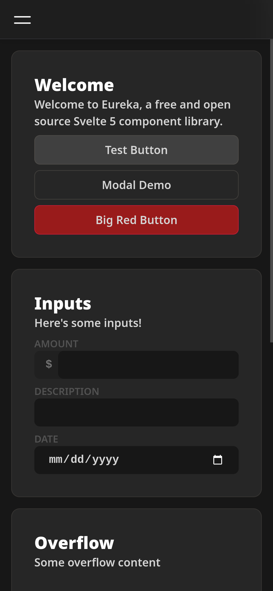
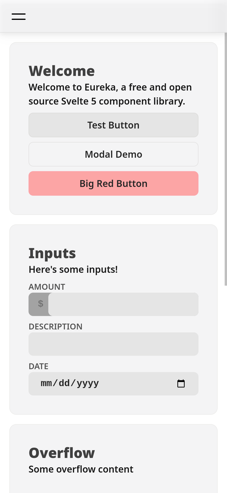
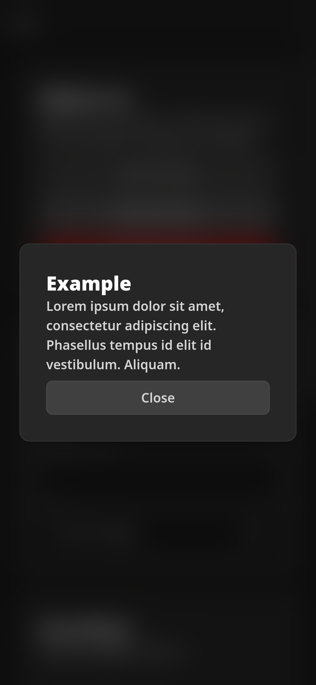
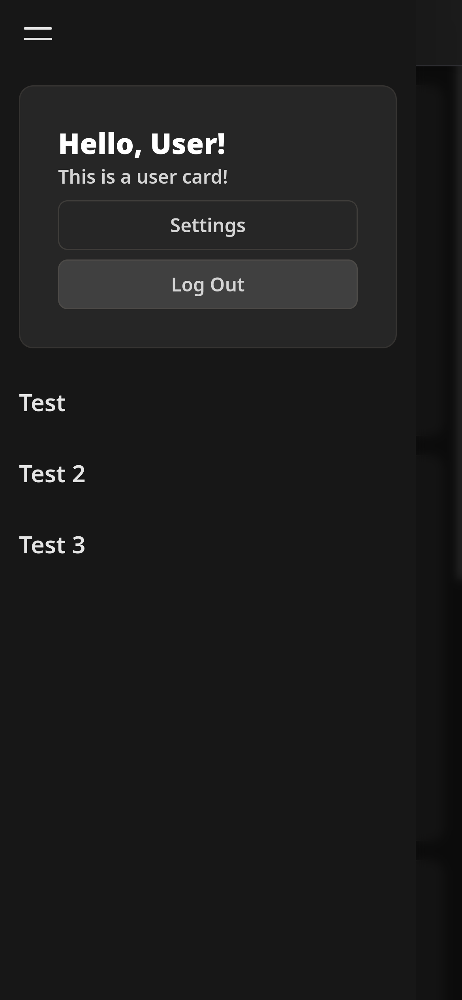

# Eureka

Inspired by Svelte magic. A free and open source Tailwind based component library for Svelte 5.

## Table of Contents

- [Eureka](#eureka)
  - [Table of Contents](#table-of-contents)
  - [Features](#features)
  - [Installation](#installation)
  - [License](#license)

## Features

- Fast and Minimal
- Modern
- Easy for normal folks

## Images





## Installation

1.Install the package (`npm install @kerosenelabs/eureka`)

2. Add the CSS to your `app.css`

```css
import "@kerosenelabs/eureka/components.css"
```

3. Import components, start making cool things! There's examples in this repositories `+page.svelte` and `+layout.svelte`.

## License

Please see [LICENSE.md](LICENSE.md).
